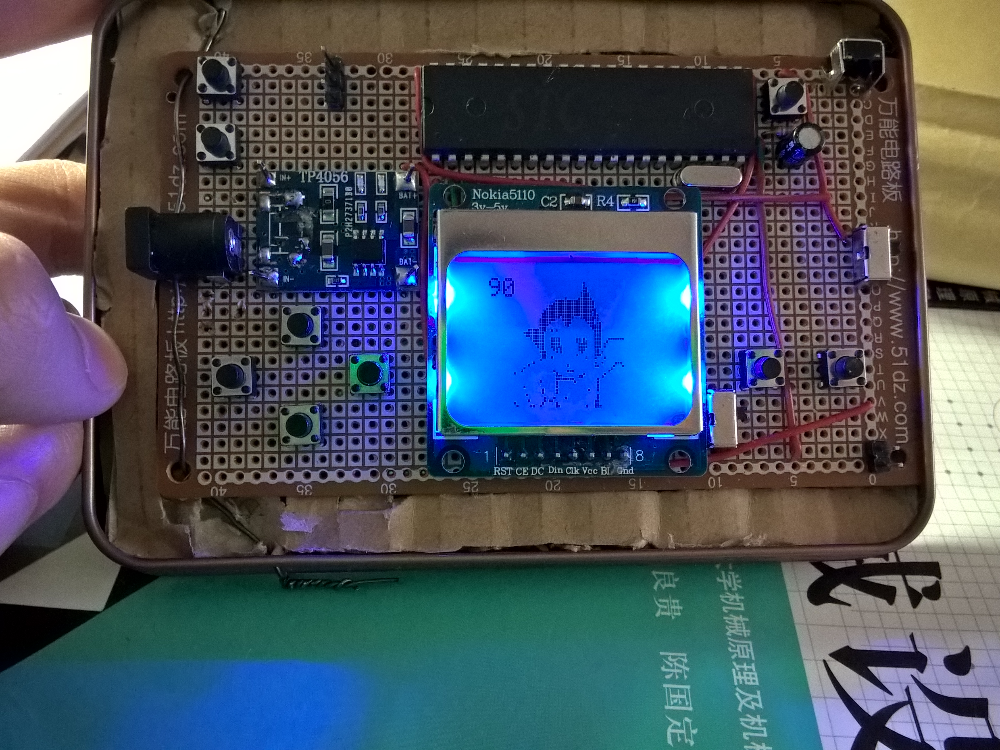
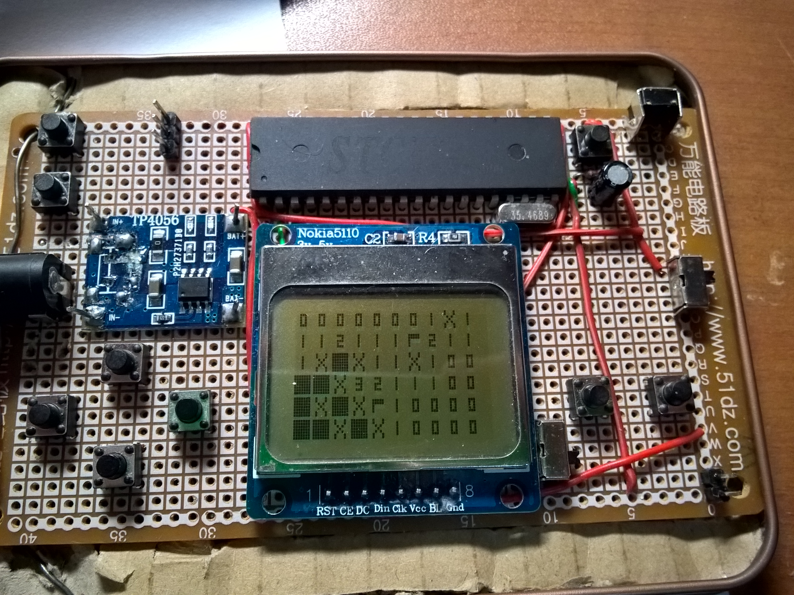
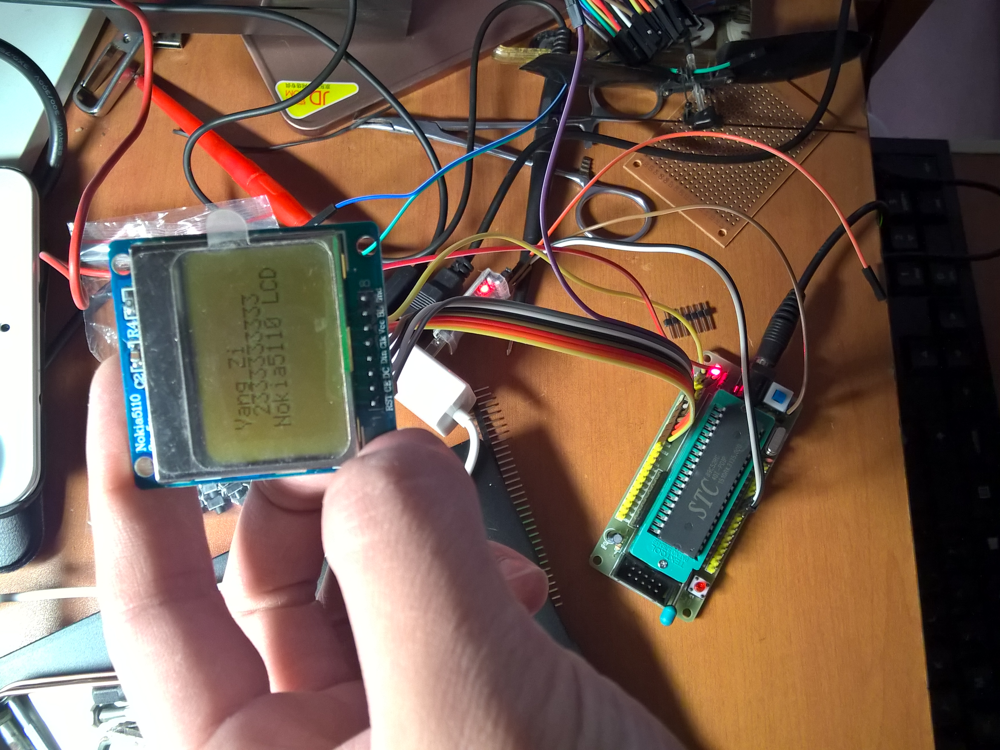

# Ybox
用 51 单片机做的掌机

## 主要元件
2. 导线若干
4. 单排排针若干
1. 漆包铜线若干
1. USB 转 ttl x1
1. 万能电路板 x1
2. 铁皮盒子 x1
1. 纸板 x1
1. 细铁丝若干
1. USB C充电板 x1
1. 36M 晶振 x1
1. 电解电容 10uf x1
1. 滑动开关 x1
1. 按钮开关 x1
1. 51 单片机 STC89C52RC x1
2. NOKIA 5110 LCD x1
3. 6*6*6MM微动开关 按键开关 卧式 x9

## 效果图

